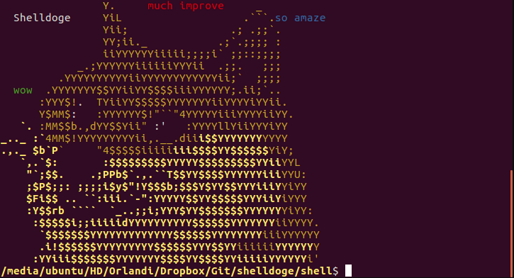

# Shelldoge



OVERVIEW
--------------------------------------------------
This is a implementation of a shell for the [Operating
Systems 2] course. It was made at the Computer Science undergraduate program from University of São Paulo (ICMC - USP).

DISTRIBUTION AND USE
--------------------------------------------------
Users can find a distribution in the tab [releases][release].

Run Shelldoge with:

```bash
  $ cd shelldoge
  $ cd shell
  $ ./shelldoge
```

Shelldoge can execute external commands like `ls` and `clear` and the following internal commands:

* `cd`
* `jobs`
* `fg`
* `bg`
* `exit`
* `quit` (same as exit)

Shelldoge will also handle signals (so you can kill and suspend processes), redirect input and output (Shelldoge's parser will handle the right order and whitespaces) and use pipe to run multiple programs at the same time.

Shelldoge allows some arguments too. To see the version run:

```bash
  $ ./shelldoge --version
```

Run commands from arguments:

```bash
  $ ./shelldoge --command "ls --color" "cd .." ls exit
  or
  $ ./shelldoge -c "ls --color" "cd .." ls exit
```

Run commands from script files instead of keyboard to be the input (make sure to add an `exit` or `quit` at the end of the file, or something bad will happen):

```bash
  $ ./shelldoge script.txt
```

BUILD AND INSTALL
--------------------------------------------------
For developers and builders follow the steps below.

Clone Shelldoge repository:

```bash
  $ git clone https://github.com/SOII-2016/shelldoge.git
```

Shelldoge development environment rely on the [GNU Build system
(Autotools)][autotools].  Developers may be able to bootstrap the project by issuing:

```bash
  $ cd shelldoge
  $ ./autogen.sh
```

The provided autogen.sh script should execute autoconf, automake, libtool
and related programs in the right order.

Builders should be able to run:

```bash
 $ ./configure --prefix=<somepath>
 $ make
 $ make install
```

Builders should also be able to create distribution archives:

```bash
 $ make dist
```

The distributed files should contain all the files needed for building Shelldoge at the builder's environment, without the need of Autotools.

LICENSE
--------------------------------------------------
[GPLv3][license]

Shelldoge, Copyright (c) 2016 Luan G. O. <luan.orlandi@usp.br>,
Renato J. A. <renato.jose93@gmail.com> and Wesley T. <wes@usp.br>
Shelldoge is derived from [POSIX-eg][credits], Copyright (c) 2015 Monaco F. J. <<monaco@icmc.usp.br>>

This file is part of Shelldoge.

Shelldoge is free software: you can redistribute it and/or modify
it under the terms of the GNU General Public License as published by
the Free Software Foundation, either version 3 of the License, or
(at your option) any later version.

Shelldoge is distributed in the hope that it will be useful,
but WITHOUT ANY WARRANTY; without even the implied warranty of
MERCHANTABILITY or FITNESS FOR A PARTICULAR PURPOSE.  See the
GNU General Public License for more details.

You should have received a copy of the GNU General Public License
along with Shelldoge.  If not, see <http://www.gnu.org/licenses/>.

[SO2]: <https://github.com/SOII-2016>
[release]: <https://github.com/SOII-2016/shelldoge/releases>
[autotools]: <http://www.gnu.org/software/automake/manual/html_node/Autotools-Introduction.html>
[license]: <COPYING>
[credits]: <https://gitlab.com/monaco/posixeg>
